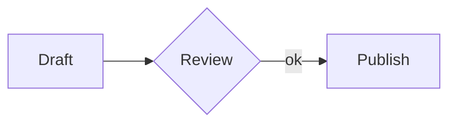
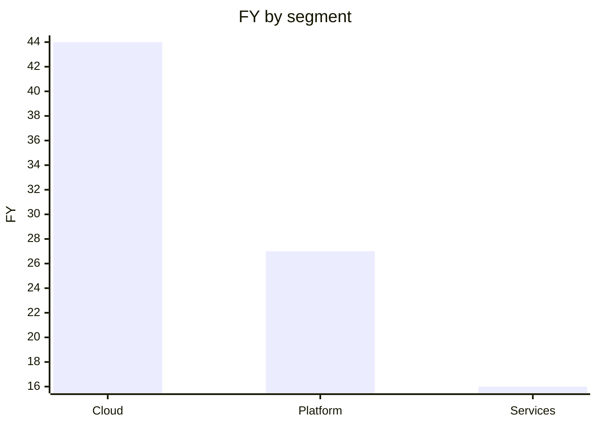

# GEML — General Expressive Markup Language

*English | [中文](README_CN.md)*

**One format, two readers.**<br>
Humans read it with no tools; AI rewrites it without breaking references.

GEML is plain text — organized by **one typed block for everything**, remembered by a **`.gemlhistory` sidecar**.

`1.0`

<!-- TODO(launch): add the before/after demo GIF here once recorded:

-->

---

GEML is a markup language for structured documents. A `.geml` file reads as plain text, so you never need a renderer to read it. And instead of a separate mini-syntax for each kind of content, GEML puts everything on one construct: the **typed block**.

```
=== code {#hello lang=python}
print("hi")
===
```

Code is a block. So are tables, diagrams, math, callouts, and document metadata. The shape is the same every time, which makes the format easy to learn and hard to get wrong.

## Why a new format now

Markdown was designed for documents that **people hand-write and people read**. Today the same documents are also written, edited, reviewed, and queried by **AI agents and CI pipelines** — and that shift asks three things of a format that Markdown was never built to give:

- **Predictable structure**, so a model emits valid output instead of guessing among a pile of per-feature special cases.
- **References that can be verified**, so an automated edit that breaks a link fails loudly instead of rotting silently.
- **History that travels with the document**, so a reader — human or agent — can see how and why it changed, offline and with no external service.

GEML is built around those three. The goal wasn't to bolt "AI features" onto a document format. It was to pick a format that is both simpler for people and more dependable for machines.

## What's different about GEML

Plenty of formats do one or two of these. What's unusual about GEML is that one plain-text format does all three:

1. **One primitive for every structured block.** Code, tables, diagrams, math, callouts, metadata — all the same `=== type {…}` typed block. One grammar to learn, one grammar to generate correctly: no per-feature syntax, no HTML fallback.
2. **References checked at build time.** Put an `#id` on any block and reference it anywhere; a dangling reference or a broken cross-document link is a build **error**, not a silent 404. Automated edits can't quietly rot.
3. **Self-contained version history.** A sibling `.gemlhistory` file reconstructs any past revision and rolls the document back — offline, with no git and no service — and it's plain text an agent can read to understand how the document evolved.

For a fuller side-by-side across **Markdown, HTML, CommonMark, AsciiDoc, and Org-mode**, see the [format comparison](COMPARISON.md).

## The format in 5 minutes

### Typed blocks

Every kind of content is the same shape — only the **type** (and what goes in the body) changes:

```
=== code {lang=python}
print("hi")
===

=== note {.intro}
Parsed prose with *emphasis* and a [[#budget]] reference.
===

=== meta
title = "Budget plan"
===
```

A run of `=` (three or more) opens a block; an equal-length run closes it; longer fences nest inside shorter ones. The type decides how the body is read — `raw` (verbatim: `code`, `diagram`, `math`, `table`), `flow` (parsed prose with inline markup: `note`), or `data` (one `key=val` per line: `meta`) — and every block may carry an attribute object `{#id .class key=val}`, where a `.class` is a *semantic* label, never a styling hook. The full inline grammar (emphasis, links, `[[#id]]` auto-references, media, footnotes, inline `$math$`) is in the [spec](GEML-spec.md).

### Tables — two bodies, one model

Write a table visually:

```
=== table {#budget caption="Annual cost"}
| Plan  | Months | Rate |
|-------|-------:|-----:|
| Basic |      1 |   30 |
| Pro   |      2 |   30 |
===
```

…or as data, with **computed columns** and a **summary row**:

```
=== table {#fy25 format=csv header=1 compute="FY [%.1f] = Q1 + Q2 + Q3 + Q4" summary="Segment = 'Total'; FY [%.1f] = sum(FY)"}
Segment,  Q1, Q2, Q3, Q4
Cloud,     8, 10, 12, 14
Platform,  5,  6,  7,  9
Services,  3,  4,  4,  5
===
```

*Both forms describe the same model. The `FY` column and `Total` row are computed at build time:*

| Segment   | Q1 | Q2 | Q3 | Q4 |   FY |
|-----------|---:|---:|---:|---:|-----:|
| Cloud     |  8 | 10 | 12 | 14 | 44.0 |
| Platform  |  5 |  6 |  7 |  9 | 27.0 |
| Services  |  3 |  4 |  4 |  5 | 16.0 |
| **Total** |    |    |    |    | **87.0** |

`compute` runs `+ - * / ( )` per row over columns; `summary` adds a foot row from the aggregates `sum / avg / min / max / count` (with arithmetic over them, e.g. weighted ratios); a trailing `[printf]` sets numeric display.

### Diagrams & charts — host a DSL, or chart a table

GEML never interprets a diagram body; it routes it to a pluggable renderer (an unknown `format` is a warning, body preserved):

```
=== diagram {#flow format=mermaid caption="Review flow"}
graph LR
  A[Draft] --> B{Review} -->|ok| C[Publish]
===
```



A diagram can also **chart a table** — single source of truth, with the column references checked at build time and no data copied:

```
=== diagram {format=geml-chart data=#fy25 type=bar x=Segment y=FY}
===
```

*Drawn from the `#fy25` table above:*



### Math

```
=== math {#gauss caption="Gaussian integral"}
\int_{-\infty}^{\infty} e^{-x^2} dx = \sqrt{\pi}
===
```

$$\int_{-\infty}^{\infty} e^{-x^2} dx = \sqrt{\pi}$$

**Next:** read the [full spec](GEML-spec.md) (EN / [中文](GEML-spec_CN.md)), or ▶ **[try it in your browser](https://geml-spec.github.io/geml-spec/playground/)** — break a reference and watch the build go red.

## Why this works for humans and AI

The same shape that makes GEML pleasant to read by hand is what makes it reliable under automation:

- **Plain text, no rendering step.** A model reads and writes `.geml` directly. What it sees is the document.
- **One uniform primitive.** There's far less to get wrong when generating or parsing than with Markdown's special cases.
- **Build-time reference checking.** A broken cross-reference is a hard error, so an automated edit either resolves its links or fails.
- **Structured content stays textual.** Tables, math, diagrams, and metadata all live in plain text. An agent edits them without leaving the text or emitting HTML.
- **Machine-readable feedback.** The parser emits a document-model JSON with a `diagnostics` array, so agents and CI get a structured pass/fail signal.

## Ecosystem

- **Reference parser + CLI** — [`geml-parser/`](geml-parser/) (TypeScript / Node 22). Parses a document to **document-model JSON** and exits non-zero on errors.
  ```sh
  cd geml-parser && npm install && npm run build
  node dist/geml.js ../GEML-spec.geml      # parse → JSON (+ diagnostics)
  npm test
  ```
- **Self-contained renderer** — `node dist/geml.js render <file.geml> -o out.html` turns a document into one self-contained, interactive HTML file: sortable/filterable tables, `geml-chart` as inline SVG drawn from its table, rendered diagrams, and the build-time checks carried through to a non-zero exit. See [`examples/`](examples/).
- **Markdown → GEML converter** — `node dist/geml.js convert <file.md> [-o out.geml]`. Maps frontmatter → `meta`, fenced code → `code`, ` ```mermaid/graphviz/… ` → `diagram`, `$$` → `math`, blockquote → `note`, GFM tables → `table`, footnotes, autolinks, and setext → ATX.
- **GEML → Markdown export** — `node dist/geml.js export <file.geml> [-o out.md]` projects a document to GFM: frontmatter from `meta`, computed tables as GFM tables, `note` as blockquotes, footnotes, fenced code/mermaid, `$$` math. Lossy by nature — Markdown has no typed-block primitive — so each unmappable construct (`geml-chart`, `{hidden}`, block ids) is reported as a note.
- **Canonical formatter** — `node dist/geml.js fmt <file.geml> [-o out.geml]` re-serializes the document model back to canonical GEML (the inverse of the parser). `parse(serialize(parse(x)))` is the same model — a round-trip property checked across the test suite — and the output is idempotent.
- **Browser extension** — [`geml-viewer/`](geml-viewer/) renders `.geml` locally (`file://`) and on the web: tables with computed columns, `geml-chart` as inline SVG, Mermaid diagrams, KaTeX math, and the build-time diagnostics shown as a banner.
- **Addressable blocks** — `geml get <file.geml> #id` prints one block by id; `geml set <file.geml> #id` swaps just that block, re-parsing and refusing the write if it would break the document. An agent edits one section without re-reading or re-emitting the whole file.
- **Versioned history** — `geml history <commit | verify | show | restore | log> <file.geml>` over the self-contained [`.gemlhistory`](GEML-history-spec.md) sidecar, plus `geml revert <file.geml> #id [--to -1]` to roll a single block back to an earlier revision (by `-N` offset, `latest`, or id). Addressable *and* versioned — the substrate for an agent that revises a document step by step and can rewind any one section.

## Using GEML with an LLM

GEML is meant to be **written by models**, not just read by them. The loop is the
same everywhere — the model emits `.geml`, you validate, it fixes:

```sh
npm i -g @geml/geml           # installs the `geml` command
geml check file.geml          # exit 0 = valid; otherwise it prints what is wrong
geml check --json file.geml   # machine-readable diagnostics, for an agent loop
```

- **Claude Code / Claude CLI.** Install the package above, then copy
  [`.claude/skills/geml/`](.claude/skills/geml/SKILL.md) into `~/.claude/skills/`.
  Claude auto-loads the authoring rules and runs `geml check` whenever it touches
  a `.geml` file — no prompting needed.
- **ChatGPT, Gemini, or any model.** Paste the primer below so the model emits
  valid GEML, then run `geml check` on the output for a hard pass/fail.

> **GEML primer.** Write the document as GEML. Every block is
> `=== type {#id .class key=val}` … `===`; the closing fence is a run of `=` of
> the *exact* opening length, and a longer fence nests a shorter one. Block types:
> `code`/`diagram`/`math`/`table` (verbatim body), `note` (prose with
> inline markup), `meta` (one `key=val` per line). Headings are ATX `#` only — no
> `---` frontmatter (use `=== meta`). Every `#id` is unique and every reference
> (`[[#id]]`, `[text](#id)`, `[^id]`, chart `data=#id`) must resolve. No raw HTML.
> Inline: `*em*`, `**strong**`, `` `code` ``, `$math$`, `[text](url)`. The
> normative spec is [`GEML-spec.md`](GEML-spec.md).

## Status, scope & contributing

GEML is **`1.0`** — stable, and used to write real documents (this repo's own spec is one).

**Maturity signals.** A complete core spec (§1–§8) plus a history-extension spec, both EN / 中文; a working reference parser, renderer + CLI; a [conformance suite](geml-parser/test/conformance/) (`input → projected document model`) reproduced by an **independent second implementation**, so emphasis and list rules can't drift between parsers, backed by 300+ unit and conformance checks (~93% line coverage, CI-gated at ≥90%); and **self-hosting** — [`GEML-spec.geml`](GEML-spec.geml) is the specification written in GEML, parsed clean on every test run.

**Design boundaries (non-goals).** GEML stays small on purpose:

- **No raw-HTML escape hatch** — semantics stay portable, tied to no backend or renderer.
- **Hosts external diagram DSLs** (Mermaid, Graphviz, D2, …) rather than inventing one.
- **Tables compute, but aren't a spreadsheet engine** — per-row formulas and summary aggregates, not cell addressing, lookups, or macros.
- **ATX headings only** — no setext, no `---` frontmatter, no thematic-break guesswork.

**Contributing.** Contributions of every kind are welcome — bug reports, tooling and integrations, broader conformance coverage, and the spec itself. GEML is 1.0, but the format can still evolve: substantive spec changes are discussed and land through a [GEP](CONTRIBUTING.md), each with its conformance case. The reference parser's test suite is the contract, so code changes should keep `npm test` green and the dogfood spec parsing clean. **The most valuable contribution is an independent parser in another language** — a portable conformance suite makes it a weekend project; see [docs/WRITING-A-PARSER.md](docs/WRITING-A-PARSER.md).

| Document | English | 中文 |
|----------|---------|------|
| Core spec | [`GEML-spec.md`](GEML-spec.md) | [`GEML-spec_CN.md`](GEML-spec_CN.md) |
| History extension | [`GEML-history-spec.md`](GEML-history-spec.md) | [`GEML-history-spec_CN.md`](GEML-history-spec_CN.md) |

## Repository layout

```
GEML-spec.md / _CN.md            Core spec (EN / 中文)
GEML-history-spec.md / _CN.md    .gemlhistory extension (EN / 中文)
GEML-spec.geml                   The spec, written in GEML (dogfood)
GEML-spec.gemlhistory            History-format sample
COMPARISON.md / _CN.md           GEML vs other markup formats
geml-parser/                     Reference parser, renderer + CLI (TypeScript, Node 22)
geml-viewer/                     Browser extension that renders .geml
examples/                        Sample .geml docs and their rendered .html
```

## License & governance

Code (`geml-parser/`, `geml-viewer/`, `geml-check-action/`) is **MIT** ([`LICENSE`](LICENSE)). The specification documents are **CC-BY-4.0** ([`LICENSE-spec.md`](LICENSE-spec.md)) — a spec is not software, and anyone may build a conformant implementation. See [`GOVERNANCE.md`](GOVERNANCE.md) for how decisions are made and [`CONTRIBUTING.md`](CONTRIBUTING.md) to get involved — **writing an independent implementation in another language is the most valuable contribution you can make.**
