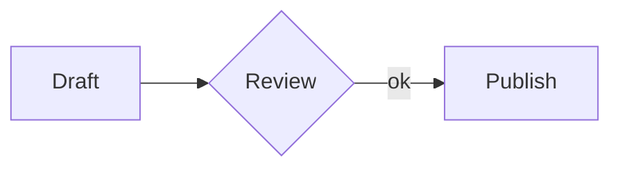
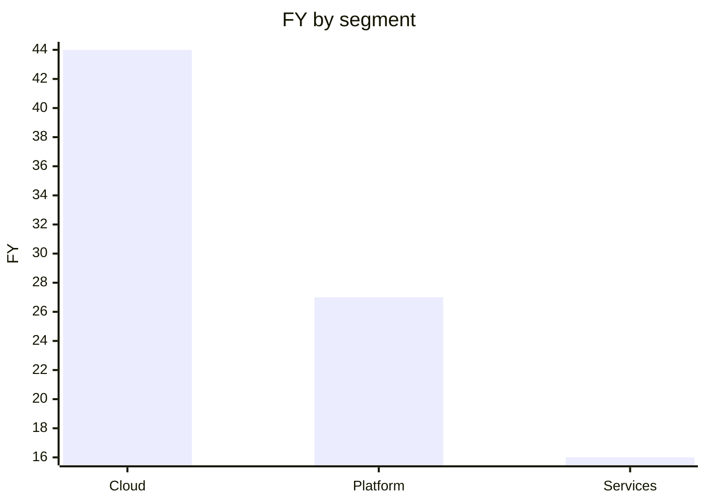

# GEML — General Expressive Markup Language（通用表达型标记语言）

*[English](README.md) | 中文*

**一种格式，两类读者。**<br>
人不装任何工具就能读；AI 重写也不会弄断引用。

GEML 是纯文本——由**一种类型块**承载一切，由一个 **`.gemlhistory` 伴生文件**记忆。

`1.0`

<!-- TODO(发布): demo GIF 录好后放这里：

-->

---

GEML 是一种面向结构化文档的标记语言。`.geml` 文件本身就是纯文本，读它不需要任何渲染器。它也不为每种内容单独设一套迷你语法，而是把所有内容都放在一个构造上：**类型块（typed block）**。

```
=== code {#hello lang=python}
print("hi")
===
```

代码是块，表格、图形、公式、提示框、乃至文档元数据，也都是块。形态每次都一样，所以这门格式好学，也难写错。

## 为什么现在需要一种新格式

Markdown 是为**人类手写、人类阅读**的文档设计的。而今天，同一批文档还要由 **AI 智能体和 CI 流水线**来书写、编辑、评审与查询——这一转变，对格式提出了三件 Markdown 从未需要提供的事：

- **可预测的结构**，让模型直接产出合法输出，而不是在一堆按特性堆叠的特例里猜。
- **可被校验的引用**，让破坏了链接的自动编辑**当场报错**，而不是悄悄烂掉。
- **随文档一起走的历史**，让读者——无论人还是智能体——能看清它如何、为何演变，离线、无需任何外部服务。

GEML 就是围绕这三点做出来的。目标不是给某种文档格式"加上 AI 功能"，而是选一种对人更简单、对机器也更可靠的格式。

## GEML 有什么不同

很多格式能做到其中一两件。GEML 的特别之处在于，一种纯文本格式三点都满足：

1. **单一原语承载一切结构化块。** 代码、表格、图形、公式、提示框、元数据——全是同一个 `=== type {…}` 类型块。一套语法要学、一套语法去正确生成：没有按特性各设的语法，也没有 HTML 兜底。
2. **引用在构建期被校验。** 给任意块标 `#id`、在任何地方引用它；悬空引用或断掉的跨文档链接是构建**错误**，而非静默的 404。自动编辑不会悄悄腐烂。
3. **自包含的版本历史。** 一个同名 `.gemlhistory` 伴生文件即可重建任意历史修订、把文档回滚——离线、无需 git、无需服务——而且它是纯文本，智能体能读懂文档的演变。

跨 **Markdown、HTML、CommonMark、AsciiDoc、Org-mode** 的完整对照，见[格式比较](COMPARISON_CN.md)。

## 五分钟看懂这个格式

### 类型块

每种内容都是同一个形态——只有**类型**（以及 body 里放什么）在变：

```
=== code {lang=python}
print("hi")
===

=== note {.intro}
解析过的散文，可用 *强调* 与 [[#budget]] 引用。
===

=== meta
title = "Budget plan"
===
```

连续的 `=`（≥3 个）开块，等长的一串闭块；更长的围栏可嵌套更短的。类型决定正文如何解读——`raw`（原样：`code`、`diagram`、`math`、`table`）、`flow`（带内联标记的散文：`note`）、或 `data`（每行一个 `key=val`：`meta`）；每个块都可携带属性对象 `{#id .class key=val}`，其中 `.class` 是*语义*标签，绝不作样式钩子。完整的内联语法（强调、链接、`[[#id]]` 自动引用、媒体、脚注、行内 `$公式$`）见[规范](GEML-spec_CN.md)。

### 表格 —— 两种正文，一个模型

可视化写法：

```
=== table {#budget caption="年度成本"}
| Plan  | Months | Rate |
|-------|-------:|-----:|
| Basic |      1 |   30 |
| Pro   |      2 |   30 |
===
```

……或写成数据，带**计算列**与**汇总行**：

```
=== table {#fy25 format=csv header=1 compute="FY [%.1f] = Q1 + Q2 + Q3 + Q4" summary="Segment = 'Total'; FY [%.1f] = sum(FY)"}
Segment,  Q1, Q2, Q3, Q4
Cloud,     8, 10, 12, 14
Platform,  5,  6,  7,  9
Services,  3,  4,  4,  5
===
```

*两种形态描述同一个模型。`FY` 列与 `Total` 行在构建期算出：*

| Segment   | Q1 | Q2 | Q3 | Q4 |   FY |
|-----------|---:|---:|---:|---:|-----:|
| Cloud     |  8 | 10 | 12 | 14 | 44.0 |
| Platform  |  5 |  6 |  7 |  9 | 27.0 |
| Services  |  3 |  4 |  4 |  5 | 16.0 |
| **Total** |    |    |    |    | **87.0** |

`compute` 对各列逐行做 `+ - * / ( )` 运算；`summary` 用聚合 `sum / avg / min / max / count`（并可对聚合结果再做算术，如加权比率）生成表尾一行；列名后的 `[printf]` 控制数字显示。

### 图形与图表 —— 托管 DSL，或为表格作图

GEML 从不解释图形正文，而是把它交给可插拔渲染器（未知 `format` 仅告警、正文原样保留）：

```
=== diagram {#flow format=mermaid caption="评审流程"}
graph LR
  A[Draft] --> B{Review} -->|ok| C[Publish]
===
```



图形还能**为一张表作图**——单一真相，列引用在构建期受校验，数据零拷贝：

```
=== diagram {format=geml-chart data=#fy25 type=bar x=Segment y=FY}
===
```

*取自上面的 `#fy25` 表：*



### 公式

```
=== math {#gauss caption="高斯积分"}
\int_{-\infty}^{\infty} e^{-x^2} dx = \sqrt{\pi}
===
```

$$\int_{-\infty}^{\infty} e^{-x^2} dx = \sqrt{\pi}$$

**下一步：** 读[完整规范](GEML-spec_CN.md)（中 / [English](GEML-spec.md)），或 ▶ **[在浏览器里试试](https://geml-spec.github.io/geml-spec/playground/)** —— 弄断一个引用，看构建变红。

## 为什么它对人和 AI 都好使

让 GEML 手读起来舒服的那套形态，也正是它在自动化下可靠的原因：

- **纯文本，没有渲染步骤。** 模型直接读写 `.geml`，它看到的就是文档本身。
- **单一统一的原语。** 比起 Markdown 的一堆特例，生成或解析时要出错的地方少得多。
- **构建期引用校验。** 断掉的交叉引用是硬错误，所以自动编辑要么把链接理顺，要么就失败。
- **结构化内容仍是文本。** 表格、公式、图形、元数据都在纯文本里。智能体不必离开文本、也不必产出 HTML 就能改它们。
- **机器可读的反馈。** 解析器产出带 `diagnostics` 数组的文档模型 JSON，智能体和 CI 由此拿到结构化的通过/失败信号。

## 生态

- **参考实现 + CLI** —— [`geml-parser/`](geml-parser/)（TypeScript / Node 22）。把文档解析为**文档模型 JSON**，有错误则以非零码退出。
  ```sh
  cd geml-parser && npm install && npm run build
  node dist/geml.js ../GEML-spec.geml      # 解析 → JSON（含 diagnostics）
  npm test
  ```
- **自包含渲染器** —— `node dist/geml.js render <file.geml> -o out.html` 把文档变成**单个自包含、可交互的 HTML 文件**：可排序/可筛选的表格、从其表格绘制为内联 SVG 的 `geml-chart`、渲染好的图形，以及贯穿到非零退出码的构建期检查。见 [`examples/`](examples/)。
- **Markdown → GEML 转换器** —— `node dist/geml.js convert <file.md> [-o out.geml]`。映射：frontmatter → `meta`、围栏代码 → `code`、` ```mermaid/graphviz/… ` → `diagram`、`$$` → `math`、引用块 → `note`、GFM 表格 → `table`、脚注、自动链接、setext → ATX。
- **GEML → Markdown 导出器** —— `node dist/geml.js export <file.geml> [-o out.md]` 把文档投影为 GFM：`meta`→frontmatter、计算表→GFM 表、`note`→引用块、脚注、围栏代码/mermaid、`$$` 公式。本质有损——Markdown 没有类型块原语——故每个无法映射的构造（`geml-chart`、`{hidden}`、块 id）都会以 note 形式报告。
- **规范格式化器** —— `node dist/geml.js fmt <file.geml> [-o out.geml]` 把文档模型重新序列化回规范 GEML（解析器的逆运算）。`parse(serialize(parse(x)))` 是同一个模型——一个由测试集校验的往返性质——且输出幂等。
- **浏览器扩展** —— [`geml-viewer/`](geml-viewer/)，在本地（`file://`）与网络上渲染 `.geml`：带计算列的表格、作为内联 SVG 的 `geml-chart`、Mermaid 图、KaTeX 公式，以及作为横幅显示的构建期诊断。
- **版本历史** —— 对自包含的 [`.gemlhistory`](GEML-history-spec_CN.md) 伴生文件执行 `geml history <commit | verify | show | restore> <file.geml>`。

## 在大模型里使用 GEML

GEML 的设计目标是**让模型来写**,而不只是给模型读。流程到处都一样——模型产出
`.geml`,你校验,它修:

```sh
npm i -g @geml/geml           # 安装 geml 命令
geml check file.geml          # 退出 0 = 合法;否则打印哪里错了
geml check --json file.geml   # 机器可读诊断,适合 agent 循环
```

- **Claude Code / Claude CLI。** 装上上面的包,再把
  [`.claude/skills/geml/`](.claude/skills/geml/SKILL.md) 拷到 `~/.claude/skills/`。
  之后 Claude 一碰 `.geml` 文件就自动加载写作规则并跑 `geml check`,无需提示。
- **ChatGPT、Gemini 或任意模型。** 把下面这段 primer 贴给模型让它产出合法 GEML,
  再对输出跑 `geml check` 拿硬性通过/失败信号。

> **GEML primer。** 把文档写成 GEML。每个块都是 `=== type {#id .class key=val}` …
> `===`;闭合围栏是与开围栏**等长**的一串 `=`,更长的围栏可嵌套更短的。块类型:
> `code`/`diagram`/`math`/`table`(原样正文)、`note`(带内联标记的散文)、
> `meta`(每行一个 `key=val`)。标题只用 ATX `#`——没有 `---` frontmatter(用
> `=== meta`)。每个 `#id` 唯一,且每个引用(`[[#id]]`、`[text](#id)`、`[^id]`、
> 图表 `data=#id`)都必须能解析。不允许 raw HTML。内联:`*强调*`、`**加粗**`、
> `` `代码` ``、`$公式$`、`[文本](url)`。规范见 [`GEML-spec_CN.md`](GEML-spec_CN.md)。

## 状态、边界与贡献

GEML 已发布 **`1.0`**——稳定,可用来写真实文档（本仓库的规范本身就是一例）。

**成熟度信号。** 完整的核心规范（§1–§8）外加历史扩展规范，均有中英两版；可用的参考实现、**渲染器** + CLI；一套[一致性测试集](geml-parser/test/conformance/)（`输入 → 投影出的文档模型`），由一个**独立的第二实现**复现，确保强调与列表规则不会在两个解析器之间漂移，另有 300+ 项单元与一致性检查兜底（参考实现约 93% 行覆盖，CI 门槛 ≥90%）；以及**自举**——[`GEML-spec.geml`](GEML-spec.geml) 是用 GEML 写成的规范本身，每次测试都被干净解析。

**设计边界（非目标）。** GEML 刻意保持小：

- **没有 raw-HTML 逃生舱**——语义保持可移植，不绑定任何后端或渲染器。
- **托管外部图形 DSL**（Mermaid、Graphviz、D2…），而非自创一套。
- **表格能计算，但不是电子表格引擎**——逐行公式与汇总聚合，没有单元格寻址、查表或宏。
- **只用 ATX 标题**——无 setext、无 `---` frontmatter、无分隔线的歧义。

**贡献。** 各种贡献都欢迎——报 bug、工具与集成、更广的一致性覆盖，以及规范本身。GEML 已是 1.0，但格式仍可演进：实质性的规范改动通过 [GEP](CONTRIBUTING.md) 讨论并落地，每项都附带对应的一致性用例。参考实现的测试套件就是契约——代码改动应保持 `npm test` 通过、且 dogfood 规范解析无误。**最有价值的贡献是用另一种语言写一个独立实现**——可移植的一致性测试集让它成为一个周末的活儿,见 [docs/WRITING-A-PARSER.md](docs/WRITING-A-PARSER.md)。

| 文档 | English | 中文 |
|------|---------|------|
| 核心规范 | [`GEML-spec.md`](GEML-spec.md) | [`GEML-spec_CN.md`](GEML-spec_CN.md) |
| 历史扩展 | [`GEML-history-spec.md`](GEML-history-spec.md) | [`GEML-history-spec_CN.md`](GEML-history-spec_CN.md) |

## 仓库结构

```
GEML-spec.md / _CN.md            核心规范（英 / 中）
GEML-history-spec.md / _CN.md    .gemlhistory 扩展（英 / 中）
GEML-spec.geml                   用 GEML 写成的规范（dogfood）
GEML-spec.gemlhistory            历史格式样例
COMPARISON.md / _CN.md           GEML 与其他标记格式的比较
geml-parser/                     参考实现、渲染器 + CLI（TypeScript, Node 22）
geml-viewer/                     渲染 .geml 的浏览器扩展
examples/                        示例 .geml 文档及其渲染出的 .html
```

## 许可与治理

代码（`geml-parser/`、`geml-viewer/`、`geml-check-action/`）为 **MIT**（[`LICENSE`](LICENSE)）。规范文档为 **CC-BY-4.0**（[`LICENSE-spec.md`](LICENSE-spec.md)）——规范不是软件，任何人都可以构建一个兼容实现。决策方式见 [`GOVERNANCE.md`](GOVERNANCE.md)，参与方式见 [`CONTRIBUTING.md`](CONTRIBUTING.md)——**用另一种语言写一个独立实现,是你能做的最有价值的贡献。**
