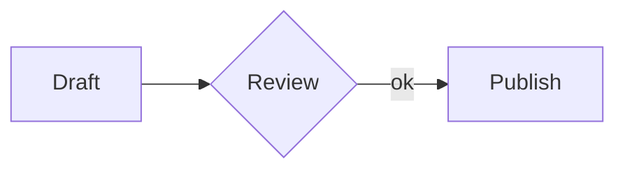
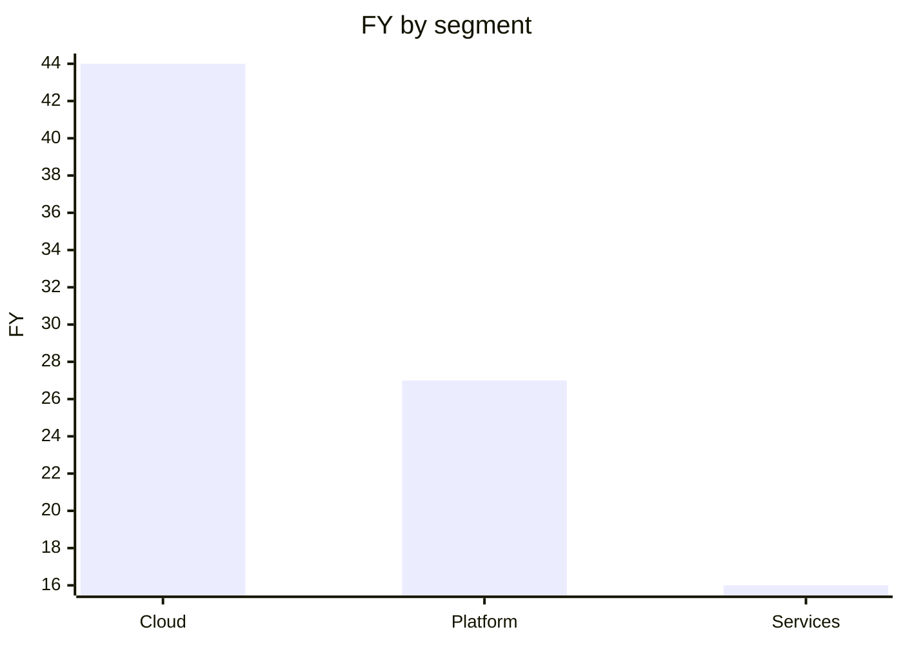

# GEML — General Expressive Markup Language（通用表达型标记语言）

*[English](README.md) | 中文*

**一种纯文本文档格式：对人保持可读，对机器保持可靠。**
*同一个类型块承载一切结构化内容——代码、表格、图形、公式、元数据。*

`1.0-draft` 规范（中英） · 参考实现 + **渲染器** + CLI（TypeScript） · **200+ 项**一致性测试 · 自举（规范本身用 GEML 写成） · 自包含版本历史 · 浏览器扩展 · MIT

---

GEML 是一种面向结构化、富表达力文档的标记语言。`.geml` 文件**作为纯文本即可完整阅读**——无需任何渲染器；它不为每一种内容各设一套迷你语法，而是用**唯一**的构造承载全部内容：**类型块（typed block）**。

```
=== code {#hello lang=python}
print("hi")
===
```

代码是块，表格、图形、公式、提示框、乃至文档元数据，也都是块。形态始终如一——这正是它**对人易学、对机器难错**的原因。

## 为什么现在需要一种新格式

Markdown 是为**人类手写、人类阅读**的文档设计的。而今天，同一批文档还要由 **AI 智能体和 CI 流水线**来书写、编辑、评审与查询——这一转变，对格式提出了三件 Markdown 从未需要提供的事：

- **可预测的结构**，让模型直接产出合法输出，而不是在一堆按特性堆叠的特例里猜。
- **可被校验的引用**，让破坏了链接的自动编辑**当场报错**，而不是悄悄烂掉。
- **随文档一起走的历史**，让读者——无论人还是智能体——能看清它如何、为何演变，离线、无需任何外部服务。

GEML 正是围绕这三点成形的。不是给格式"加 AI 功能"，而是选择一种**同时**对人更简单、对机器更可靠的形态。

## 别的格式没有、而 GEML 同时具备的三件事

很多格式能做到其中一两件。GEML 的立论是：没有别的纯文本格式**同时**具备这三件——这才是重点，而非功能数量的比拼（譬如 AsciiDoc 开箱即用的元素就比 GEML 多）：

1. **单一原语承载一切结构化块。** 代码、表格、图形、公式、提示框、元数据——全是同一个 `=== type {…}` 类型块。一套语法要学、一套语法去正确生成：没有按特性各设的语法，也没有 HTML 兜底。
2. **引用在构建期被校验。** 给任意块标 `#id`、在任何地方引用它；悬空引用或断掉的跨文档链接是构建**错误**，而非静默的 404。自动编辑不会悄悄腐烂。
3. **自包含的版本历史。** 一个同名 `.gemlhistory` 伴生文件即可重建任意历史修订、把文档回滚——离线、无需 git、无需服务——而且它是纯文本，智能体能读懂文档的演变。

跨 **Markdown、HTML、CommonMark、AsciiDoc、Org-mode** 的完整对照，见[格式比较](COMPARISON_CN.md)。

## 五分钟看懂这个格式

### 类型块

每种内容都是同一个形态——只有**类型**（以及 body 里放什么）在变：

```
=== code {lang=python}
print("hi")
===

=== note {.intro}
解析过的散文，可用 *强调* 与 [[#budget]] 引用。
===

=== meta
title = "Budget plan"
===
```

连续的 `=`（≥3 个）开块，等长的一串闭块；更长的围栏可嵌套更短的。类型决定正文如何解读——`raw`（原样：`code`、`diagram`、`math`、`table`）、`flow`（带内联标记的散文：`note`、`aside`）、或 `data`（每行一个 `key=val`：`meta`）；每个块都可携带属性对象 `{#id .class key=val}`，其中 `.class` 是*语义*标签，绝不作样式钩子。完整的内联语法（强调、链接、`[[#id]]` 自动引用、媒体、脚注、行内 `$公式$`）见[规范](GEML-spec_CN.md)。

### 表格 —— 两种正文，一个模型

可视化写法：

```
=== table {#budget caption="年度成本"}
| Plan  | Months | Rate |
|-------|-------:|-----:|
| Basic |      1 |   30 |
| Pro   |      2 |   30 |
===
```

……或写成数据，带**计算列**与**汇总行**：

```
=== table {#fy25 format=csv header=1 compute="FY [%.1f] = Q1 + Q2 + Q3 + Q4" summary="Segment = 'Total'; FY [%.1f] = sum(FY)"}
Segment,  Q1, Q2, Q3, Q4
Cloud,     8, 10, 12, 14
Platform,  5,  6,  7,  9
Services,  3,  4,  4,  5
===
```

*两种形态描述同一个模型。`FY` 列与 `Total` 行在构建期算出：*

| Segment   | Q1 | Q2 | Q3 | Q4 |   FY |
|-----------|---:|---:|---:|---:|-----:|
| Cloud     |  8 | 10 | 12 | 14 | 44.0 |
| Platform  |  5 |  6 |  7 |  9 | 27.0 |
| Services  |  3 |  4 |  4 |  5 | 16.0 |
| **Total** |    |    |    |    | **87.0** |

`compute` 对各列逐行做 `+ - * / ( )` 运算；`summary` 用聚合 `sum / avg / min / max / count`（并可对聚合结果再做算术，如加权比率）生成表尾一行；列名后的 `[printf]` 控制数字显示。

### 图形与图表 —— 托管 DSL，或为表格作图

GEML 从不解释图形正文，而是把它交给可插拔渲染器（未知 `format` 仅告警、正文原样保留）：

```
=== diagram {#flow format=mermaid caption="评审流程"}
graph LR
  A[Draft] --> B{Review} -->|ok| C[Publish]
===
```



图形还能**为一张表作图**——单一真相，列引用在构建期受校验，数据零拷贝：

```
=== diagram {format=geml-chart data=#fy25 type=bar x=Segment y=FY}
===
```

*取自上面的 `#fy25` 表：*



### 公式

```
=== math {#gauss caption="高斯积分"}
\int_{-\infty}^{\infty} e^{-x^2} dx = \sqrt{\pi}
===
```

$$\int_{-\infty}^{\infty} e^{-x^2} dx = \sqrt{\pi}$$

## 人与 AI，源于设计

让 GEML 适合手写阅读的那套形态，正是它在自动化下可靠的原因——这不是附加项，而是设计的必然结果：

- **纯文本、零渲染。** 模型直接读写 `.geml`；它看到的*就是*文档本身。
- **单一统一原语。** 比起 Markdown 的一堆特例，生成或解析的歧义少得多，畸形输出的边缘情况也少得多。
- **构建期引用校验。** 断掉的交叉引用是硬错误，于是自动编辑可靠，而非悄悄腐烂。
- **结构化内容仍在文本模态。** 表格、公式、图形、元数据都是一等公民，*且*仍是纯文本——智能体无需离开文本模态、也不必产出 HTML 就能操作它们。
- **机器可校验的反馈。** 解析器产出带 `diagnostics` 的文档模型 JSON，智能体与 CI 由此得到结构化的通过/失败信号。

## 生态

- **参考实现 + CLI** —— [`geml-parser/`](geml-parser/)（TypeScript / Node 22）。把文档解析为**文档模型 JSON**，有错误则以非零码退出。
  ```sh
  cd geml-parser && npm install && npm run build
  node dist/geml.js ../GEML-spec.geml      # 解析 → JSON（含 diagnostics）
  npm test
  ```
- **自包含渲染器** —— `node dist/geml.js render <file.geml> -o out.html` 把文档变成**单个自包含、可交互的 HTML 文件**：可排序/可筛选的表格、从其表格绘制为内联 SVG 的 `geml-chart`、渲染好的图形，以及贯穿到非零退出码的构建期检查。见 [`examples/`](examples/)。
- **Markdown → GEML 转换器** —— `node dist/geml.js convert <file.md> [-o out.geml]`。映射：frontmatter → `meta`、围栏代码 → `code`、` ```mermaid/graphviz/… ` → `diagram`、`$$` → `math`、引用块 → `note`、GFM 表格 → `table`、脚注、自动链接、setext → ATX。
- **规范格式化器** —— `node dist/geml.js fmt <file.geml> [-o out.geml]` 把文档模型重新序列化回规范 GEML（解析器的逆运算）。`parse(serialize(parse(x)))` 是同一个模型——一个由测试集校验的往返性质——且输出幂等。
- **浏览器扩展** —— [`geml-viewer/`](geml-viewer/)，在本地（`file://`）与网络上渲染 `.geml`：带计算列的表格、作为内联 SVG 的 `geml-chart`、Mermaid 图、KaTeX 公式，以及作为横幅显示的构建期诊断。
- **版本历史** —— 对自包含的 [`.gemlhistory`](GEML-history-spec_CN.md) 伴生文件执行 `geml history <commit | verify | show | restore> <file.geml>`。

## 状态、边界与贡献

GEML 处于 **`1.0-draft`**——已稳定到能用来写真实文档（本仓库的规范本身就是一例），1.0 前仍会打磨。

**成熟度信号。** 完整的核心规范（§1–§8）外加历史扩展规范，均有中英两版；可用的参考实现、**渲染器** + CLI；**200+ 项**测试——单元测试，外加一套[一致性测试集](geml-parser/test/conformance/)（`输入 → 投影出的文档模型`），并由一个**独立的第二实现**复现，确保强调与列表规则不会在两个解析器之间漂移；以及**自举**——[`GEML-spec.geml`](GEML-spec.geml) 是用 GEML 写成的规范本身，每次测试都被干净解析。

**设计边界（非目标）。** GEML 刻意保持小：

- **没有 raw-HTML 逃生舱**——语义保持可移植，不绑定任何后端或渲染器。
- **托管外部图形 DSL**（Mermaid、Graphviz、D2…），而非自创一套。
- **表格能计算，但不是电子表格引擎**——逐行公式与汇总聚合，没有单元格寻址、查表或宏。
- **只用 ATX 标题**——无 setext、无 `---` frontmatter、无分隔线的歧义。

**路线与贡献。** 通往 1.0 的路是：规范打磨、更广的一致性覆盖、渲染器/工具链集成。欢迎 issue 与 PR；参考实现的测试套件就是契约——改动应保持 `npm test` 通过、且 dogfood 规范解析无误。

| 文档 | English | 中文 |
|------|---------|------|
| 核心规范 | [`GEML-spec.md`](GEML-spec.md) | [`GEML-spec_CN.md`](GEML-spec_CN.md) |
| 历史扩展 | [`GEML-history-spec.md`](GEML-history-spec.md) | [`GEML-history-spec_CN.md`](GEML-history-spec_CN.md) |

## 仓库结构

```
GEML-spec.md / _CN.md            核心规范（英 / 中）
GEML-history-spec.md / _CN.md    .gemlhistory 扩展（英 / 中）
GEML-spec.geml                   用 GEML 写成的规范（dogfood）
GEML-spec.gemlhistory            历史格式样例
COMPARISON.md / _CN.md           GEML 与其他标记格式的比较
geml-parser/                     参考实现、渲染器 + CLI（TypeScript, Node 22）
geml-viewer/                     渲染 .geml 的浏览器扩展
examples/                        示例 .geml 文档及其渲染出的 .html
```

## 许可

MIT。
